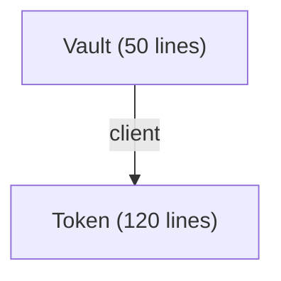

# 📊 Soroban Contract Dependency Graph

A static analysis tool to visualize, audit, and analyze cross-contract relationships and dependency hierarchies for Soroban smart contracts.

## 📁 Location
`src/analysis/dependency-graph/`

## ✨ Features
1. **Multi-Pattern Contract Detection**: Identifies contract names defined via standard Soroban structural patterns, macros (`#[contract]`, `#[contracttype]`), or fallback file-name heuristics.
2. **Interaction Tracking**: Detects dependencies automatically by scanning source code for:
   - Instantiate-and-call contract client signatures (`<Contract>Client::new(...)`)
   - Low-level env invocations (`env.invoke_contract(...)`)
   - Direct WASM contract imports (`contractimport!(file = "...")`)
3. **Cycle Detection**: Walks the contract interaction graph to detect circular dependencies (e.g., `A -> B -> A`), critical for preventing call stack exhaustions and design flaws.
4. **Topological Order Sorting**: Computes the optimal deployment sequence showing which contracts depend on others (deploy leaf-nodes first).
5. **Visualization Exports**:
   - Generates Mermaid diagram markup (`graph TD`) for easy rendering in Markdown viewers.
   - Outputs JSON representations for custom rendering or downstream linting.

## 🛠️ Usage Example

```typescript
import { SorobanDependencyAnalyzer } from './src/analysis/dependency-graph';

const analyzer = new SorobanDependencyAnalyzer();

const files = [
  { filePath: 'src/token.rs', source: tokenRustSource },
  { filePath: 'src/vault.rs', source: vaultRustSource }
];

// Run analysis
const graph = analyzer.analyze(files);

// Detect cycles
const cycles = analyzer.detectCycles(); // e.g. [['A', 'B', 'A']]

// Get deployment order
const deploymentOrder = analyzer.getTopologicalOrder(); // e.g. ['Token', 'Vault']

// Generate Mermaid visualization
const mermaidDiagram = analyzer.generateMermaid();
console.log(mermaidDiagram);
```

### Generated Mermaid Output Example

